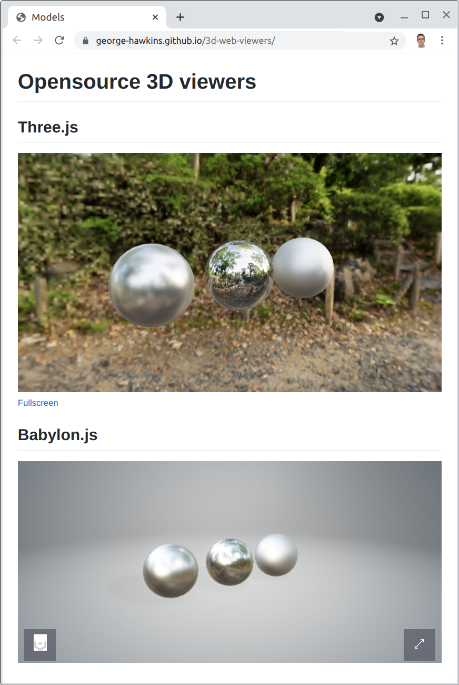

GLTF viewers
============

I decided to investigate the best way to display [gLTF](https://en.wikipedia.org/wiki/GlTF) 3D models on a web page. My conclusion is that easiest thing is to use [Sketchfab](https://sketchfab.com/). Various opensource projects are happy to use it on their sites (e.g. see [here](https://alicevision.org/#results) on the Meshroom site). However, Sketchfab is not opensource and some of the features (such as specifying your own HDRI) are only available to paying customers.

If you want to host your assets yourself (and have full control) then the best opensource alternatives to Sketchfab seem to be [three.js](https://threejs.org/) and [babylon.js](https://www.babylonjs.com/).

Both have online sandboxes where you can drag and drop `.gltf`, `.glb` and `.obj` files and experiment with what it's possible to do with these libraries:

* [Babylon.js sandbox](https://sandbox.babylonjs.com/).
* [Three.js sandbox](https://gltf-viewer.donmccurdy.com/).

Babylon.js provides a ready to go viewer that does things like centering and sizing your model to best fit within the viewer area and provides a default skybox, ground, shadows etc. which can be configured as covered in their [documentation](https://doc.babylonjs.com/extensions/babylonViewer).

Three.js just provide a very basic [viewer example](https://threejs.org/examples/#webgl_loader_gltf) which you can use as the basis for your own viewer and extend using the documentation for the [`GLTFLoader`](https://threejs.org/docs/index.html#examples/en/loaders/GLTFLoader) etc. An alternative starting off point might be the source code for the three.js sandbox which can be found [here](https://github.com/donmccurdy/three-gltf-viewer).

Initially, the babylon.js viewer was quicker to get started with but in the end it proved just as complicated as with three.js. Once you start wanting to do things like e.g. set an HDRI environment texture, you have to start resorting to Javascript.

You can see the results of my efforts with both libraries [here](https://george-hawkins.github.io/3d-web-viewers/) - a simple scene consisting of three spheres, lit by an HDRI. For the babylon.js viewer, I gave up also trying to use the HDRI as the background but I'm sure it's possible.

You can find the HTML in [`index.html`](index.html) and from there get to all the relevant Javascript etc.

Credits
-------

The HDRI, used here, is by Greg Zaal and can be found [here](https://polyhaven.com/a/ninomaru_teien) on Poly Haven. It's the same HDRI as `forest.exr` that's found in Blender (see [here](https://github.com/blender/blender/tree/v2.93.1/release/datafiles/studiolights/world)).

The CSS for the three.js viewer was taken from the code that accompanied [this article](https://manu.ninja/webgl-3d-model-viewer-using-three-js/) by Manuel Timelthaler on creating a 3D viewer using three.js.
